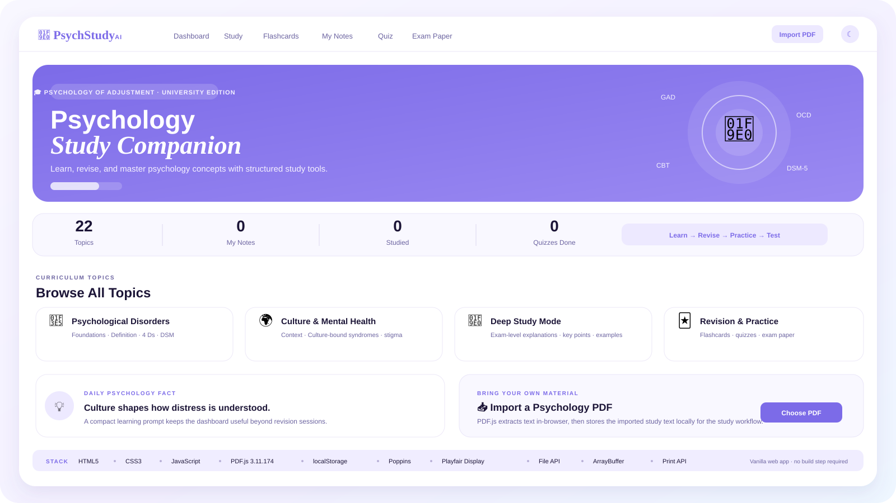

<div align="center">



# 🧠 PsychStudy 2.0

### **Learn Better. Revise Faster. Master Psychology with Confidence.**

A production-quality psychology study platform built with modular architecture, local mastery analytics, and structured learning workflows. Study, revise, practice, and master psychology concepts—all offline, completely free.

<br>

[](https://chillingbing648-sketch.github.io/Psych-Study/)
[](https://github.com/chillingbing648-sketch/Psych-Study)
[](https://developer.mozilla.org/en-US/docs/Web/HTML)
[](https://developer.mozilla.org/en-US/docs/Web/CSS)
[](https://developer.mozilla.org/en-US/docs/Web/JavaScript)
[]()
[]()

</div>

---

## ✨ Preview

<p align="center">
  <a href="https://chillingbing648-sketch.github.io/Psych-Study/">
    
  </a>
</p>

<p align="center"><sub>Product-style overview based on the current application's real navigation, learning flows and visual system.</sub></p>

---

## 🎯 What is PsychStudy AI?

**PsychStudy AI** is a browser-based psychology study environment designed to take a student from **learning → revision → practice → examination** without needing a heavy application stack.

The current application centers on a built-in knowledge base for **Psychology of Adjustment**, topic exploration, deep/quick study modes, personal notes, flashcards, quizzes, and an exam-paper workflow. The dashboard also supports importing a user's own PDF material and extracting its text in the browser. fileciteturn66file0 fileciteturn73file0

### The learning loop

```text
        📚 STUDY
           ↓
      📝 TAKE NOTES
           ↓
      🃏 REVISE
           ↓
       ✏️ QUIZ
           ↓
      📋 PRACTICE EXAM
           ↓
       🎯 REVIEW
```

---

# 🌷 Core Product Surface

| Workspace | Purpose |
|---|---|
| 📊 **Dashboard** | Central starting point with topic discovery, progress stats, daily psychology fact and PDF import. |
| 📚 **Study** | Switch between **Deep** and **Quick** learning modes with definitions, explanations, key points, examples, psychologists, treatment approaches, summaries and mnemonics. |
| 🃏 **Flashcards** | Flip-based revision with topic filtering, progress indicators and key-point reinforcement. |
| 📝 **My Notes** | Create, search, filter, edit and delete personal notes. |
| ✏️ **Quiz** | Mixed practice using fill-in-the-blank and multiple-choice questions with scoring and feedback. |
| 📋 **Exam Paper** | Structured practice paper with answer reveal and browser print support. |
| 📥 **PDF Import** | Import psychology PDFs, extract their text in-browser and retain a local copy for the study workflow. |
| 🌙 **Theme** | Light / dark theme switching is built into the interface. |

These surfaces are present in the current application markup and client logic. fileciteturn66file0 fileciteturn72file0 fileciteturn73file0

---

# 🧠 Study Engine

## Deep Study Mode

The deep mode is designed for exam-level preparation and presents a topic through a consistent learning structure:

**Definition → Detailed Explanation → Types / Symptoms → Key Exam Points → Key Psychologists → Examples → Treatment → Exam-Ready Summary → Memory Trick**. fileciteturn73file0

## Quick Revision Mode

When time is short, the same knowledge is compressed into:

**Definition → Key Points → Exam Summary → Key Names → Mnemonic**. fileciteturn73file0

This makes the application useful for both first-pass learning and last-minute revision without duplicating the underlying knowledge base.

---

# 🃏 Flashcards

The flashcard engine supports:

- Topic filtering
- Front / back flipping
- Previous / next navigation
- Progress bar
- Card counter
- Topic-derived fallback card generation
- Key-point reinforcement

The fallback generator can derive cards from the topic's existing definition, symptoms, treatment, psychologists, summary and key points instead of requiring a separate hand-authored deck for every topic. fileciteturn74file0

---

# ✏️ Quiz & 📋 Examination

### Practice Quiz

The quiz workflow combines:

```text
Section A → Fill in the Blanks
Section B → Multiple Choice
             ↓
        Auto evaluation
             ↓
        Score + feedback
             ↓
        Retry workflow
```

The current logic randomizes the question order, evaluates answers, shows explanations, calculates a percentage score and provides an exam-readiness message. fileciteturn74file0

### Exam Paper

The built-in exam workflow supports:

- Practice paper rendering
- Marks and exam metadata
- Show / hide answers
- Structured question blocks
- Browser printing

The current implementation calls the browser print flow directly. fileciteturn74file0

---

# 📥 PDF Import

PsychStudy AI can accept a local `.pdf` file and uses **PDF.js 3.11.174** loaded from cdnjs to extract text page-by-page in the browser.

The current workflow is:

```text
Local PDF
   ↓
File / ArrayBuffer
   ↓
PDF.js
   ↓
Page text extraction
   ↓
Study text
   ↓
localStorage
```

Imported material is retained locally as a stored item containing the filename, extracted text slice and import date. fileciteturn73file0

> PDF import currently requires the PDF.js CDN script to load successfully.

---

# 💾 Local-First Study Data

The application uses browser `localStorage` for persistent student state, including notes, progress, quiz count, theme-related state and imported PDF data. fileciteturn73file0

### This keeps the architecture intentionally simple

```text
No backend
No database setup
No build pipeline required
        ↓
Open in browser
        ↓
Start studying
```

---

# 🎨 Design System

The current interface uses a light-first pastel visual system with dark-mode support.

### Core visual language

- 💜 Lavender primary
- 💙 Soft blue accents
- 🌿 Mint success states
- 🌸 Pink highlights
- 🧈 Amber emphasis
- 🧾 High-contrast editorial text hierarchy

### Typography

The application explicitly loads:

- **Poppins** — interface and general UI typography
- **Playfair Display** — editorial headings and brand personality

These fonts are declared in the current `index.html`. fileciteturn66file0

---

# 🛠️ Technology Stack

<div align="center">

| Layer | Technology |
|---|---|
| Markup | **HTML5** |
| Styling | **CSS3** |
| Application Logic | **Vanilla JavaScript (ES6+)** |
| Study Data | **JavaScript knowledge-base objects** |
| Persistence | **Web Storage / localStorage** |
| PDF Processing | **PDF.js 3.11.174** |
| File Handling | **File API + ArrayBuffer** |
| UI Theme | **HTML `data-theme` + CSS variables** |
| Typography | **Poppins + Playfair Display** |
| Printing | **Browser `window.print()`** |
| Hosting Model | **Static web application** |
| Version Control | **Git + GitHub** |

</div>

### No framework is required

This repository is intentionally implemented as a lightweight vanilla web application:

```text
HTML
 │
 ├── UI structure
 │
CSS
 │
 ├── design system
 │   ├── responsive layout
 │   ├── light / dark themes
 │   └── interaction states
 │
JavaScript
 │
 ├── knowledge base
 ├── navigation
 ├── study renderer
 ├── notes
 ├── flashcards
 ├── quiz engine
 ├── exam renderer
 ├── PDF import
 └── local persistence
```

The repository currently contains `index.html`, `style.css`, and `script.js` as its complete application source. fileciteturn64file0

---

# 📂 Project Structure

```text
Psych-Study/
│
├── assets/
│   └── psychstudy-overview.svg
│
├── .gitignore
├── README.md
├── index.html
├── style.css
└── script.js
```

The source tree is intentionally compact: the current repository contains five top-level project files plus the README and the branded documentation asset added for this presentation. fileciteturn64file0

---

# 🔬 Knowledge Architecture

The application's psychology curriculum is stored as structured JavaScript objects rather than unstructured page copy.

Each topic can carry fields such as:

```text
id
name
category
icon
preview
definition
explanation
keyPoints
types
symptoms
psychologists
examples
treatment
summary
mnemonic
```

That structure is what makes the same source material reusable across **Deep Study, Quick Revision, Flashcards and other study surfaces**. fileciteturn68file0 fileciteturn73file0

---

# 🎓 Designed For

PsychStudy AI is aimed at students preparing for:

- University examinations
- Internal assessments
- Competitive examinations
- Quick revision sessions
- Topic-by-topic psychology study

The original project positioning specifically calls out psychology students and Indian education exam patterns. fileciteturn65file0

---

# 🚀 Run Locally

There is no framework installation step.

### Option 1 — Open directly

Download the repository and open:

```text
index.html
```

in a modern browser.

### Option 2 — Serve locally

Using Python:

```bash
python -m http.server 8000
```

Then open:

```text
http://localhost:8000
```

The repository's original documentation also specifies opening `index.html` directly with no installation required. fileciteturn65file0

---

# 🌐 Deployment

Because PsychStudy AI is a static HTML/CSS/JavaScript application, it can be deployed to static hosting such as GitHub Pages without a framework build step.

```text
Git Push
   ↓
GitHub Repository
   ↓
Static Hosting
   ↓
🌐 PsychStudy AI
```

---

# 📈 Engineering Snapshot

| Area | Status |
|---|:---:|
| Core UI | 🟢 |
| Topic Knowledge Base | 🟢 |
| Deep Study Mode | 🟢 |
| Quick Revision Mode | 🟢 |
| Flashcards | 🟢 |
| Personal Notes | 🟢 |
| Quiz Engine | 🟢 |
| Exam Paper | 🟢 |
| PDF Import | 🟢 |
| Light / Dark Theme | 🟢 |
| Local Persistence | 🟢 |
| Responsive Interface | 🟢 |
| Automated Tests | 🟡 |
| Accessibility Hardening | 🟡 |
| Offline PDF Processing | 🟡 |
| Expanded Analytics | 🟡 |

**Current stage: functional study companion / active improvement**

---

# 🗺️ Roadmap

### Next-generation improvements

- [ ] Smarter topic-level progress analytics
- [ ] Weak-area detection from quiz performance
- [ ] Spaced-repetition scheduling
- [ ] More granular PDF-to-topic organization
- [ ] Export / import of notes
- [ ] Offline-first asset caching
- [ ] Accessibility audit and keyboard-first navigation
- [ ] Dedicated mobile study experience
- [ ] Richer question bank management
- [ ] Study streaks and revision planning

The roadmap expands the existing learning model rather than adding unrelated product surfaces.

---

# 🧭 Product Philosophy

### **One subject. One workspace. One learning loop.**

PsychStudy AI is intentionally compact.

Instead of scattering the student's work across separate tools, it keeps the core loop together:

```text
Learn
  ↓
Understand
  ↓
Write
  ↓
Revise
  ↓
Practice
  ↓
Test
  ↓
Improve
```

The interface can stay visually playful while the study workflow remains structured.

---

# 🤝 Contributing

```bash
git checkout -b feature/my-feature
```

Make your change, verify the application in a browser, then:

```bash
git add .
git commit -m "feat: describe your change"
git push origin feature/my-feature
```

Open a Pull Request with:

- What changed
- Why it changed
- What was tested
- Any UI or study-content considerations

---

# ⚠️ Academic & Mental-Health Disclaimer

PsychStudy AI is an educational study tool.

Its psychology content is intended for **learning and examination preparation** and should not be treated as professional medical, psychiatric, diagnostic, or therapeutic advice.

---

# 🔗 Links

<div align="center">

🌐 [**Open PsychStudy AI**](https://chillingbing648-sketch.github.io/Psych-Study/)

&nbsp; · &nbsp;

💻 [**GitHub Repository**](https://github.com/chillingbing648-sketch/Psych-Study)

</div>

---

<div align="center">

## 🧠 PsychStudy AI

### *Learn. Revise. Practice. Master.*

`📚` `🧠` `🃏` `📝` `✏️` `📋` `📥` `✨`

<br>

<sub>Built with HTML5 · CSS3 · JavaScript · PDF.js · localStorage</sub>

<br><br>

**Made by Harsh Dubey**

</div>

<div align="center">


# 🧠 PsychStudy AI

### **Learn Better. Revise Faster. Walk Into the Exam Ready.**

A focused psychology study companion built around structured topic learning, personal notes, interactive flashcards, quizzes, practice examinations, and in-browser PDF importing.

<br>

[](https://chillingbing648-sketch.github.io/Psych-Study/)
[](https://github.com/chillingbing648-sketch/Psych-Study)
[](https://developer.mozilla.org/en-US/docs/Web/HTML)
[](https://developer.mozilla.org/en-US/docs/Web/CSS)
[](https://developer.mozilla.org/en-US/docs/Web/JavaScript)

</div>

---

## ✨ Preview

<p align="center">
  <a href="https://chillingbing648-sketch.github.io/Psych-Study/">
    
  </a>
</p>

<p align="center"><sub>Product-style overview based on the current application's real navigation, learning flows and visual system.</sub></p>

---

## 🎯 What is PsychStudy AI?

**PsychStudy AI** is a browser-based psychology study environment designed to take a student from **learning → revision → practice → examination** without needing a heavy application stack.

The current application centers on a built-in knowledge base for **Psychology of Adjustment**, topic exploration, deep/quick study modes, personal notes, flashcards, quizzes, and an exam-paper workflow. The dashboard also supports importing a user's own PDF material and extracting its text in the browser. fileciteturn66file0 fileciteturn73file0

### The learning loop

```text
        📚 STUDY
           ↓
      📝 TAKE NOTES
           ↓
      🃏 REVISE
           ↓
       ✏️ QUIZ
           ↓
      📋 PRACTICE EXAM
           ↓
       🎯 REVIEW
```

---

# 🌷 Core Product Surface

| Workspace | Purpose |
|---|---|
| 📊 **Dashboard** | Central starting point with topic discovery, progress stats, daily psychology fact and PDF import. |
| 📚 **Study** | Switch between **Deep** and **Quick** learning modes with definitions, explanations, key points, examples, psychologists, treatment approaches, summaries and mnemonics. |
| 🃏 **Flashcards** | Flip-based revision with topic filtering, progress indicators and key-point reinforcement. |
| 📝 **My Notes** | Create, search, filter, edit and delete personal notes. |
| ✏️ **Quiz** | Mixed practice using fill-in-the-blank and multiple-choice questions with scoring and feedback. |
| 📋 **Exam Paper** | Structured practice paper with answer reveal and browser print support. |
| 📥 **PDF Import** | Import psychology PDFs, extract their text in-browser and retain a local copy for the study workflow. |
| 🌙 **Theme** | Light / dark theme switching is built into the interface. |

These surfaces are present in the current application markup and client logic. fileciteturn66file0 fileciteturn72file0 fileciteturn73file0

---

# 🧠 Study Engine

## Deep Study Mode

The deep mode is designed for exam-level preparation and presents a topic through a consistent learning structure:

**Definition → Detailed Explanation → Types / Symptoms → Key Exam Points → Key Psychologists → Examples → Treatment → Exam-Ready Summary → Memory Trick**. fileciteturn73file0

## Quick Revision Mode

When time is short, the same knowledge is compressed into:

**Definition → Key Points → Exam Summary → Key Names → Mnemonic**. fileciteturn73file0

This makes the application useful for both first-pass learning and last-minute revision without duplicating the underlying knowledge base.

---

# 🃏 Flashcards

The flashcard engine supports:

- Topic filtering
- Front / back flipping
- Previous / next navigation
- Progress bar
- Card counter
- Topic-derived fallback card generation
- Key-point reinforcement

The fallback generator can derive cards from the topic's existing definition, symptoms, treatment, psychologists, summary and key points instead of requiring a separate hand-authored deck for every topic. fileciteturn74file0

---

# ✏️ Quiz & 📋 Examination

### Practice Quiz

The quiz workflow combines:

```text
Section A → Fill in the Blanks
Section B → Multiple Choice
             ↓
        Auto evaluation
             ↓
        Score + feedback
             ↓
        Retry workflow
```

The current logic randomizes the question order, evaluates answers, shows explanations, calculates a percentage score and provides an exam-readiness message. fileciteturn74file0

### Exam Paper

The built-in exam workflow supports:

- Practice paper rendering
- Marks and exam metadata
- Show / hide answers
- Structured question blocks
- Browser printing

The current implementation calls the browser print flow directly. fileciteturn74file0

---

# 📥 PDF Import

PsychStudy AI can accept a local `.pdf` file and uses **PDF.js 3.11.174** loaded from cdnjs to extract text page-by-page in the browser.

The current workflow is:

```text
Local PDF
   ↓
File / ArrayBuffer
   ↓
PDF.js
   ↓
Page text extraction
   ↓
Study text
   ↓
localStorage
```

Imported material is retained locally as a stored item containing the filename, extracted text slice and import date. fileciteturn73file0

> PDF import currently requires the PDF.js CDN script to load successfully.

---

# 💾 Local-First Study Data

The application uses browser `localStorage` for persistent student state, including notes, progress, quiz count, theme-related state and imported PDF data. fileciteturn73file0

### This keeps the architecture intentionally simple

```text
No backend
No database setup
No build pipeline required
        ↓
Open in browser
        ↓
Start studying
```

---

# 🎨 Design System

The current interface uses a light-first pastel visual system with dark-mode support.

### Core visual language

- 💜 Lavender primary
- 💙 Soft blue accents
- 🌿 Mint success states
- 🌸 Pink highlights
- 🧈 Amber emphasis
- 🧾 High-contrast editorial text hierarchy

### Typography

The application explicitly loads:

- **Poppins** — interface and general UI typography
- **Playfair Display** — editorial headings and brand personality

These fonts are declared in the current `index.html`. fileciteturn66file0

---

# 🛠️ Technology Stack

<div align="center">

| Layer | Technology |
|---|---|
| Markup | **HTML5** |
| Styling | **CSS3** |
| Application Logic | **Vanilla JavaScript (ES6+)** |
| Study Data | **JavaScript knowledge-base objects** |
| Persistence | **Web Storage / localStorage** |
| PDF Processing | **PDF.js 3.11.174** |
| File Handling | **File API + ArrayBuffer** |
| UI Theme | **HTML `data-theme` + CSS variables** |
| Typography | **Poppins + Playfair Display** |
| Printing | **Browser `window.print()`** |
| Hosting Model | **Static web application** |
| Version Control | **Git + GitHub** |

</div>

### No framework is required

This repository is intentionally implemented as a lightweight vanilla web application:

```text
HTML
 │
 ├── UI structure
 │
CSS
 │
 ├── design system
 │   ├── responsive layout
 │   ├── light / dark themes
 │   └── interaction states
 │
JavaScript
 │
 ├── knowledge base
 ├── navigation
 ├── study renderer
 ├── notes
 ├── flashcards
 ├── quiz engine
 ├── exam renderer
 ├── PDF import
 └── local persistence
```

The repository currently contains `index.html`, `style.css`, and `script.js` as its complete application source. fileciteturn64file0

---

# 📂 Project Structure

```text
Psych-Study/
│
├── assets/
│   └── psychstudy-overview.svg
│
├── .gitignore
├── README.md
├── index.html
├── style.css
└── script.js
```

The source tree is intentionally compact: the current repository contains five top-level project files plus the README and the branded documentation asset added for this presentation. fileciteturn64file0

---

# 🔬 Knowledge Architecture

The application's psychology curriculum is stored as structured JavaScript objects rather than unstructured page copy.

Each topic can carry fields such as:

```text
id
name
category
icon
preview
definition
explanation
keyPoints
types
symptoms
psychologists
examples
treatment
summary
mnemonic
```

That structure is what makes the same source material reusable across **Deep Study, Quick Revision, Flashcards and other study surfaces**. fileciteturn68file0 fileciteturn73file0

---

# 🎓 Designed For

PsychStudy AI is aimed at students preparing for:

- University examinations
- Internal assessments
- Competitive examinations
- Quick revision sessions
- Topic-by-topic psychology study

The original project positioning specifically calls out psychology students and Indian education exam patterns. fileciteturn65file0

---

# 🚀 Run Locally

There is no framework installation step.

### Option 1 — Open directly

Download the repository and open:

```text
index.html
```

in a modern browser.

### Option 2 — Serve locally

Using Python:

```bash
python -m http.server 8000
```

Then open:

```text
http://localhost:8000
```

The repository's original documentation also specifies opening `index.html` directly with no installation required. fileciteturn65file0

---

# 🌐 Deployment

Because PsychStudy AI is a static HTML/CSS/JavaScript application, it can be deployed to static hosting such as GitHub Pages without a framework build step.

```text
Git Push
   ↓
GitHub Repository
   ↓
Static Hosting
   ↓
🌐 PsychStudy AI
```

---

# 📈 Engineering Snapshot

| Area | Status |
|---|:---:|
| Core UI | 🟢 |
| Topic Knowledge Base | 🟢 |
| Deep Study Mode | 🟢 |
| Quick Revision Mode | 🟢 |
| Flashcards | 🟢 |
| Personal Notes | 🟢 |
| Quiz Engine | 🟢 |
| Exam Paper | 🟢 |
| PDF Import | 🟢 |
| Light / Dark Theme | 🟢 |
| Local Persistence | 🟢 |
| Responsive Interface | 🟢 |
| Automated Tests | 🟡 |
| Accessibility Hardening | 🟡 |
| Offline PDF Processing | 🟡 |
| Expanded Analytics | 🟡 |

**Current stage: functional study companion / active improvement**

---

# 🗺️ Roadmap

### Next-generation improvements

- [ ] Smarter topic-level progress analytics
- [ ] Weak-area detection from quiz performance
- [ ] Spaced-repetition scheduling
- [ ] More granular PDF-to-topic organization
- [ ] Export / import of notes
- [ ] Offline-first asset caching
- [ ] Accessibility audit and keyboard-first navigation
- [ ] Dedicated mobile study experience
- [ ] Richer question bank management
- [ ] Study streaks and revision planning

The roadmap expands the existing learning model rather than adding unrelated product surfaces.

---

# 🧭 Product Philosophy

### **One subject. One workspace. One learning loop.**

PsychStudy AI is intentionally compact.

Instead of scattering the student's work across separate tools, it keeps the core loop together:

```text
Learn
  ↓
Understand
  ↓
Write
  ↓
Revise
  ↓
Practice
  ↓
Test
  ↓
Improve
```

The interface can stay visually playful while the study workflow remains structured.

---

# 🤝 Contributing

```bash
git checkout -b feature/my-feature
```

Make your change, verify the application in a browser, then:

```bash
git add .
git commit -m "feat: describe your change"
git push origin feature/my-feature
```

Open a Pull Request with:

- What changed
- Why it changed
- What was tested
- Any UI or study-content considerations

---

# ⚠️ Academic & Mental-Health Disclaimer

PsychStudy AI is an educational study tool.

Its psychology content is intended for **learning and examination preparation** and should not be treated as professional medical, psychiatric, diagnostic, or therapeutic advice.

---

# 🔗 Links

<div align="center">

🌐 [**Open PsychStudy AI**](https://chillingbing648-sketch.github.io/Psych-Study/)

&nbsp; · &nbsp;

💻 [**GitHub Repository**](https://github.com/chillingbing648-sketch/Psych-Study)

</div>

---

<div align="center">

## 🧠 PsychStudy AI

### *Learn. Revise. Practice. Master.*

`📚` `🧠` `🃏` `📝` `✏️` `📋` `📥` `✨`

<br>

<sub>Built with HTML5 · CSS3 · JavaScript · PDF.js · localStorage</sub>

<br><br>

**Made by Harsh Dubey**

</div>
